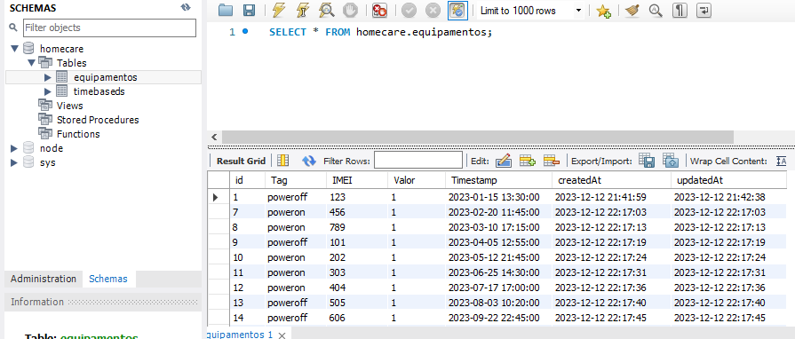
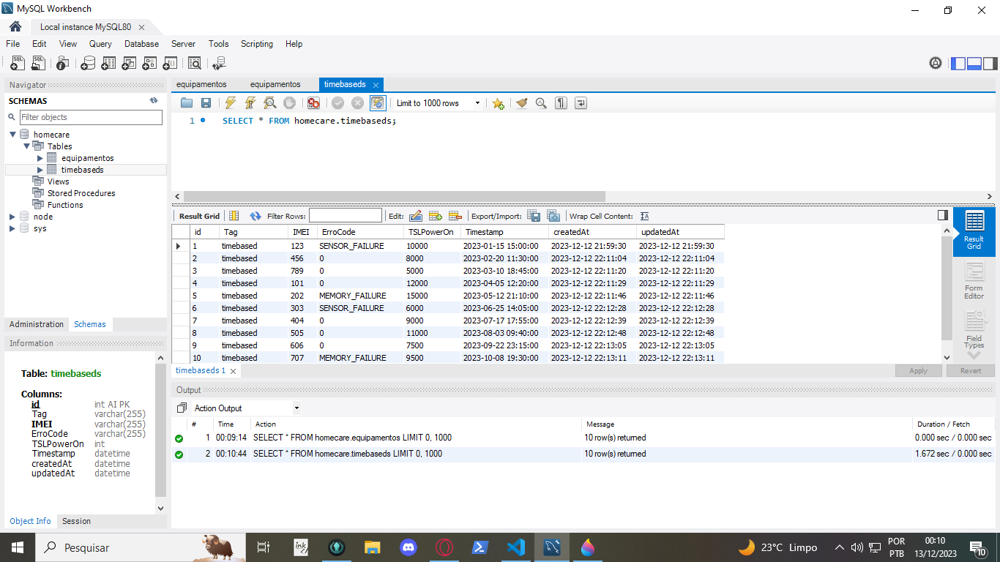

# Projeto de sistema de IOT para uma empresa HomeCare:

## Objetivo/Proposta

Imagine que você foi contratado para desenvolver um sistema de IoT para o setor de home care de uma grande empresa. Esta empresa tem diversos dispositivos que retornam dados como PowerON (quando o equipamento é ligado), PowerOff (quando o equipamento é desligado), TimeBased (cada equipamento reporta a cada 30 segundos).

As mensagens seguem um mesmo formato: Tag,IMEI, Valor, Timestamp

Exemplos:
poweron,1231231213, 1, new DateTime()
poweroff,1231231213 1, new DateTime()
timebased,1231231213,
errorCode=MEMORY_FAILURE;timeSinceLastPowerOnMinutes=4000, new DateTime()

Considerações:

· O sistema deverá possuir uma API para ingerir os dados publicados pelos equipamentos e armazená-los em algum lugar;
· Essa empresa estima que 1000 equipamentos poderão reportar dados simultaneamente;
· O sistema deverá apresentar esses dados através de um navegador web;
·  Tela para exibir todos os equipamentos ativos (equipamentos que reportaram dados nos últimos 30 minutos);
·  Tela para exibir todos os equipamentos que não estão reportando e com um status indicando o tempo que um determinado equipamento não reporta dados;
·  24h sem reportar Warning
·  >24h sem reportar Critical
·  Tela para exibir um gráfico mostrando todos os equipamentos ligados e todos os equipamentos desligados (equipamentos que emitiram um poweroff como última mensagem).
·  Cada equipamento é capaz de publicar para a API errorCodes
·  O sistema deverá ter uma tela com as sugestões de ações que o operador deverá realizar quando recebe código de falha dos equipamentos se um determinado equipamento possui código de falha BAD_CONFIGURATION o operador do sistema tem que ser orientado na tela para abrir um chamado de assistência técnica.

## Backend

Em relação a API e ao banco de dados, optei por utilizar o Node.js e mysql; No código há rotas para receber requisições que enviam um json e salvam no banco de dados.

Como fiquei em dúvida em relação ao envio de dados, imaginei dessa forma:

Uma tabela para armazenar os equipamentos poweroff e poweron assim como outros detalhes
{
  "Tag": "poweroff",
  "IMEI": "707",
  "Valor": 1,
  "Timestamp": "2023-10-08T16:00:00"
}

e uma tabela para armazerar timebased e seus possiveis erros:

{
	"Tag": "timebased",
	"IMEI": "707",
	"ErroCode": "MEMORY_FAILURE",
	"TSLPowerOn": 9500,
	"Timestamp": "2023-10-08T16:30:00"
}

com errocode = 0 caso nao possua erros.

No codigo também há rotas get que retornam a tabela do banco de dados com todos os json para trabalhar no front end.

OBS: como não tenho prática em relação a um banco de dados online acabou sendo local mesmo

## Frontend

Em relação ao front e a exibição dos dados, optei por usar o react e axios para criar as paginas e pegar os dados do servidor.

Contudo por falta de tempo e experiência não consegui finalizar essa exibição dos dados. Mas a ideia era um pagina intuitiva mostrando a situação, erros etc.