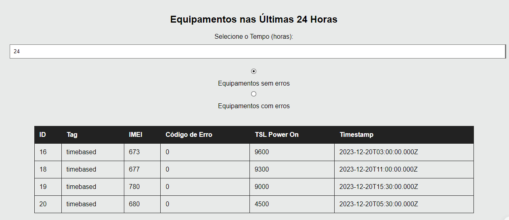

# Projeto de sistema de IOT para uma empresa HomeCare:

## Objetivo/Proposta

Imagine que você foi contratado para desenvolver um sistema de IoT para o setor de home care de uma grande empresa. Esta empresa tem diversos dispositivos que retornam dados como PowerON (quando o equipamento é ligado), PowerOff (quando o equipamento é desligado), TimeBased (cada equipamento reporta a cada 30 segundos).

As mensagens seguem um mesmo formato: Tag,IMEI, Valor, Timestamp

Exemplos:
poweron,1231231213, 1, new DateTime()
poweroff,1231231213 1, new DateTime()
timebased,1231231213,
errorCode=MEMORY_FAILURE;timeSinceLastPowerOnMinutes=4000, new DateTime()

Considerações:

· O sistema deverá possuir uma API para ingerir os dados publicados pelos equipamentos e armazená-los em algum lugar;
· Essa empresa estima que 1000 equipamentos poderão reportar dados simultaneamente;
· O sistema deverá apresentar esses dados através de um navegador web;
·  Tela para exibir todos os equipamentos ativos (equipamentos que reportaram dados nos últimos 30 minutos);
·  Tela para exibir todos os equipamentos que não estão reportando e com um status indicando o tempo que um determinado equipamento não reporta dados;
·  24h sem reportar Warning
·  >24h sem reportar Critical
·  Tela para exibir um gráfico mostrando todos os equipamentos ligados e todos os equipamentos desligados (equipamentos que emitiram um poweroff como última mensagem).
·  Cada equipamento é capaz de publicar para a API errorCodes
·  O sistema deverá ter uma tela com as sugestões de ações que o operador deverá realizar quando recebe código de falha dos equipamentos se um determinado equipamento possui código de falha BAD_CONFIGURATION o operador do sistema tem que ser orientado na tela para abrir um chamado de assistência técnica.

## Backend

Em relação a API e ao banco de dados, optei por utilizar o Node.js e mysql; No código há rotas para receber requisições que enviam um json e salvam no banco de dados.

Como fiquei em dúvida em relação ao envio de dados, imaginei dessa forma:

Uma tabela para armazenar os equipamentos poweroff e poweron assim como outros detalhes

### Formato dos jsons

{
  "Tag": "poweroff",
  "IMEI": "707",
  "Valor": 1,
  "Timestamp": "2023-10-08T16:00:00"
}

](Components/TabelaEquipamentos.jpg)

e uma tabela para armazerar timebased e seus possiveis erros:

{
	"Tag": "timebased",
	"IMEI": "707",
	"ErroCode": "MEMORY_FAILURE",
	"TSLPowerOn": 9500,
	"Timestamp": "2023-10-08T16:30:00"
}

](Components/TabelaTimeBased.jpg)

Em relação ao ErroCode, desenvolvi dessa forma :
- ErroCode = 0 -> Funcionamento Normal do Equipamento
- ErroCode = SENSOR_FAILURE -> Erro em relação ao sensor
- ErroCode = MEMORY_FAILURE -> Erro de memoria do equipamento
- ErroCode = BAD_CONfIGURATION -> Erro de configuração
- ErroCOde = ERRO_CRITICAL -> Erro critido no equipamento

Caso haja diferentes tipo de erros, é possível adapatar o código para que seja tratado de maneira correspondente.

No codigo também há rotas get que retornam a tabela do banco de dados com todos os json para trabalhar no front end.

OBS: como não tenho prática em relação a um banco de dados online acabou sendo local mesmo (o jsons usados estão na página Components)

## Frontend

Em relação ao front e a exibição dos dados, optei por usar o react e axios para criar as paginas e pegar os dados do servidor.

### Equipamentos Ativos

Nessa página é exibido apenas o equipamentos que estão ativos (poweron) naquele momento. A página pega os dados do servidor, filtra e coloca em forma de tabela

### Equipamentos Não Ativos

](Components/EquipN%C3%A3oAtivos.png)

De forma semelhante, essa página apenas exibi os equipamento que não estão ativos (poweoff) naquele momento, pegando os dados e filtrando para a tabela.

### Monitoramento

A partir do banco de dados TimeBased, que recebe constamente relatorios de funcionamento dos equipamentos, temos essa tabela que exibe os mesmo dados porém com alguns detalhes a mais.
- Cor vermelha nas células que possuem algum tipo de erro (Código de Erro != 0)
- Entrada de filtro para escrever um erro especifico
- Função de click nas celulas vermelhas para exibir um texto com sugestão de como resolver o problema
- Link de Chamada tecnica que leva a pagina para chamar uma assistência tecnica

Exemplo de filtro para ErroSensor

#### Assistência Tecnica

](Components/ChamadaTecnica.png)

Nessa página apenas temos um formulario simples com IMEI, TSL (Tempo de Funcionamento) do equipamento e um campo para alguma observação. O botão apenas pega esses dados e escreve um window.alert sem realmente se conectar a APi, mas em caso de implementação teria apenas que adaptar.

### Erros24h

Nessa página é exibido uma tabela com base no tempo. O valor padrão é 24h, mostrando todos os equipamentos naquele horário. Além disso é possível não só escolher o tempo como escolher também se são os equipamentos com erros ou sem erros.

### Gráfico

Por fim temos uma página simples que exibe os equipamentos ativos e inativos em formato de gráfico, dando uma melhor noção em caso de milhares de equipamentos.